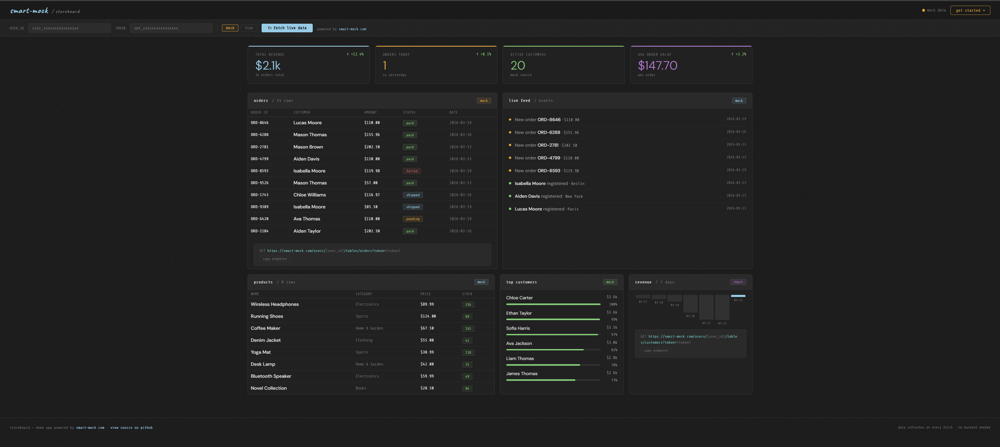

# StoreBoard

A live e-commerce dashboard that fetches real data from [smart-mock.com](https://smart-mock.com) — no backend, no database, no setup.

[**→ Live demo**](https://smart-mock.com/demo/storeboard)

---

## What it is

StoreBoard is a single HTML file that turns your smart-mock schema into a working dashboard. It shows orders, products, customers, revenue charts, and a live event feed — all pulled from your smart-mock API endpoint.

Works in two modes:

|Mode|What happens|
|-|-|
|**Mock**|Runs immediately with generated data. No account needed.|
|**Live**|Enter your smart-mock `user\_id` + token → fetches your real tables.|

---

## Quickstart

### 1\. Clone and open

```bash
git clone https://github.com/your-username/storeboard.git
cd storeboard
open index.html   # or just double-click it
```

No npm. No build step. One file.

### 2\. Create your schema on smart-mock.com

Go to [smart-mock.com](https://smart-mock.com) → create three tables:

|Table|Key columns|
|-|-|
|`customers`|`id`, `first\_name`, `last\_name`, `email`, `city`, `total\_spent`|
|`products`|`id`, `name`, `category`, `price`, `stock`|
|`orders`|`id`, `customer\_id`, `product`, `amount`, `status`, `date`|

Link `orders.customer\_id` → `customers.id` via a cable to get relational data.

Full setup guide: [`schema/setup.md`](schema/setup.md)

### 3\. Connect to live data

Paste your `user\_id` and `smt\_` token into the config bar at the top of the dashboard and click **↻ fetch live data**.

Your data. Live. No backend.

---

## How it works

```
smart-mock.com
  └── customers table  ──┐
  └── products table   ──┼──► StoreBoard (index.html)
  └── orders table     ──┘         │
       (linked via cable)          └── KPIs · Orders · Products
                                       Customers · Revenue chart
```

StoreBoard calls the smart-mock REST API directly from the browser:

```js
GET https://smart-mock.com/users/{user\_id}/tables/orders?token={smt\_token}
GET https://smart-mock.com/users/{user\_id}/tables/products?token={smt\_token}
GET https://smart-mock.com/users/{user\_id}/tables/customers?token={smt\_token}
```

No proxy. No server. Just fetch.

---

## Screenshot



---

## Customize it

StoreBoard is intentionally simple — one HTML file, no dependencies, no framework.

Want different tables? Change the fetch URLs and column names in the `renderAll()` function. The whole data layer is \~50 lines of vanilla JS.

Want a different domain? Swap `products/orders/customers` for `users/sessions/events` and you have a SaaS metrics dashboard. Same idea, different tables.

---

## Built with

* [smart-mock.com](https://smart-mock.com) — live REST API for realistic fake data
* Vanilla HTML/CSS/JS — zero dependencies
* `Share Tech Mono` + `DM Sans` — Google Fonts

---

## License

MIT

